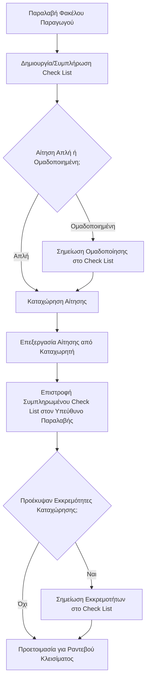

# Check List Αίτησης

Το **check list** (λίστα ελέγχου) είναι ένα κρίσιμο έντυπο που χρησιμοποιείται για κάθε αίτηση ενιαίας ενίσχυσης. Παρέχεται κατά την παραλαβή του φακέλου του παραγωγού και περιέχει βασικές παρατηρήσεις και σημεία ελέγχου, διευκολύνοντας την ομαλή επεξεργασία.

## Πληροφορίες που Περιέχει (Σημειωμένες από την Παραλαβή)
Το check list περιλαμβάνει, μεταξύ άλλων, τις εξής πληροφορίες, οι οποίες σημειώνονται από το τμήμα παραλαβής:

*   **Αλλαγές Στοιχείων Παραγωγού:**
    *   Τηλέφωνο
    *   Email
    *   Τράπεζα (IBAN)
    *   Ταυτότητα
    *   *Σημείωση:* Τα αντίστοιχα δικαιολογητικά για αυτές τις αλλαγές θα πρέπει να βρίσκονται ήδη στον φάκελο.
*   **Αγροτεμάχια:**
    *   Προσθήκες νέων αγροτεμαχίων
    *   Διαγραφές υφιστάμενων αγροτεμαχίων
*   **[[02 - Βασικοί Κανόνες και Οριζόντιες Καρτέλες Αίτησης/02.8 - Καρτέλα 10 - Οικολογικά Σχήματα|Οικολογικά Σχήματα (Eco-Schemes)]]:**
    *   Εάν ο παραγωγός συμμετέχει.
    *   Σε ποια συγκεκριμένα οικολογικά σχήματα συμμετέχει (π.χ., &#34;λιπάσματα - χρήση βραδείας αποδέσμευσης&#34;).
    *   Σημείωση για το αν ο παραγωγός συμμετέχει σε Οικολογικά Σχήματα και σε ποια συγκεκριμένα (π.χ. Βιολογικής Γεωργίας, Λιπασμάτων).
    *   Σημείωση για το αν υπάρχουν εκκρεμότητες δικαιολογητικών για τα Οικολογικά Σχήματα (π.χ. σύμβαση, πιστοποιητικό TRACES για βιολογικά).
*   **[[02 - Βασικοί Κανόνες και Οριζόντιες Καρτέλες Αίτησης/02.7 - Καρτέλα 9 - Αιτήματα Άμεσων Ενισχύσεων|Συνδεδεμένες Ενισχύσεις]]:**
    *   Ύπαρξη καρτελακίων πιστοποιημένου σπόρου για συγκεκριμένες καλλιέργειες που δικαιούνται συνδεδεμένη ενίσχυση (π.χ., αραβόσιτος, βαμβάκι).

## Σημαντικές Λειτουργίες του Check List

1.  **Ομαδοποίηση Αιτήσεων:**
    *   Αν ένας παραγωγός υποβάλλει πολλαπλές αιτήσεις (π.χ., για τον εαυτό του και για άλλα μέλη της οικογένειάς του που κάνουν κοινή φορολογική δήλωση), αυτές οι αιτήσεις θα είναι ομαδοποιημένες (&#34;πακέτο&#34;).
    *   Αν ένας παραγωγός υποβάλλει πολλαπλές αιτήσεις (π.χ., για τον εαυτό του και για άλλα μέλη της οικογένειάς του που κάνουν κοινή φορολογική δήλωση), αυτές οι αιτήσεις θα είναι ομαδοποιημένες ("πακέτο").
    *   Αυτή η πληροφορία θα είναι σημειωμένη στο check list και οι αιτήσεις αυτές **δεν πρέπει να διαχωρίζονται** κατά την επεξεργασία.
    *   Η [[03 - Αναλυτικά Στοιχεία Αίτησης (Κάθετη Στήλη)/03.3 - Στοιχεία Νοικοκυριού (Αναλυτικά)|δήλωση των στοιχείων νοικοκυριού]] είναι σχετική με αυτή τη διαδικασία.

2.  **Εμπιστευτικότητα:**
    *   Το check list περιέχει προσωπικά δεδομένα του παραγωγού και, ενδεχομένως, κωδικούς πρόσβασης.
    *   Για τον λόγο αυτό, πρέπει να παραμένει **πάντα** μέσα στον φάκελο του παραγωγού και να μην εκτίθεται σε κοινή θέα στο γραφείο, σύμφωνα με τις αρχές του [[02 - Βασικοί Κανόνες και Οριζόντιες Καρτέλες Αίτησης/02.10 - Καρτέλα 12 - Συγκατάθεση GDPR|GDPR]].

3.  **Επιστροφή μετά την Καταχώρηση:**
    *   Μετά την ολοκλήρωση της καταχώρησης της δήλωσης από εσάς, το check list επιστρέφεται στον υπεύθυνο παραλαβής.
    *   Εκεί θα σημειωθούν τυχόν εκκρεμότητες που προέκυψαν κατά την καταχώρηση.
    *   Θα χρησιμοποιηθεί για την προετοιμασία του [[06 - Ολοκλήρωση και Τελικές Διαδικασίες/06.2 - Προετοιμασία Φακέλου για Ραντεβού Κλεισίματος|ραντεβού κλεισίματος]] με τον παραγωγό.
    *   Να σημειώνονται στο check list οι εκκρεμότητες για τα δικαιολογητικά των οικολογικών σχημάτων (π.χ. σύμβαση, πιστοποιητικό TRACES, βεβαίωση από γεωπόνο για λιπάσματα).
    *   Ειδικές παρατηρήσεις για ΑΤΑΚ που δεν είναι έγκυρα ή έχουν θέματα.

## Διάγραμμα Ροής Check List

