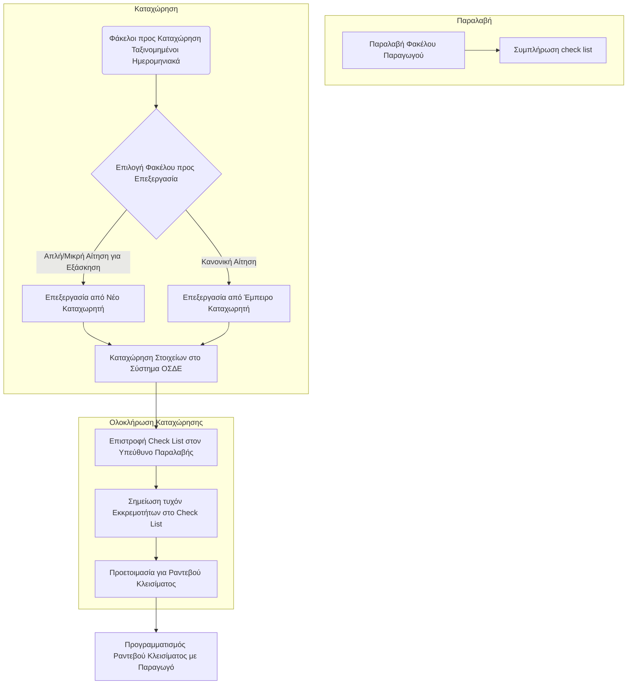

# Διαχείριση Φακέλων & Ροή Εργασίας

Η ορθή διαχείριση των φακέλων και η τήρηση μιας συγκεκριμένης ροής εργασίας είναι καθοριστικής σημασίας για την αποτελεσματική και δίκαιη επεξεργασία των αιτήσεων.

## Σειρά Επεξεργασίας Φακέλων
Η επεξεργασία των φακέλων των παραγωγών γίνεται με βάση την **ημερομηνία παραλαβής** τους. Αυτό διασφαλίζει:
*   **Δικαιοσύνη:** Αποφεύγονται οι διακρίσεις και όλοι οι παραγωγοί εξυπηρετούνται με σειρά προτεραιότητας.
*   **Αποφυγή παρεξηγήσεων:** Η τήρηση της χρονικής σειράς ελαχιστοποιεί τις αμφισβητήσεις.

## Αρχική Φάση Επεξεργασίας (Εξάσκηση)
Αρχικά, για λόγους εξάσκησης των νέων καταχωρητών, θα δίνονται μικρότερες και λιγότερο πολύπλοκες αιτήσεις. Σταδιακά, θα αναλαμβάνονται και πιο σύνθετες περιπτώσεις.

## Στόχος Ροής Εργασίας
Κύριος στόχος είναι η **συνεχής και αδιάλειπτη ροή των ραντεβού** για το [[06 - Ολοκλήρωση και Τελικές Διαδικασίες/06.2 - Προετοιμασία Φακέλου για Ραντεβού Κλεισίματος|κλείσιμο των αιτήσεων]] με τους παραγωγούς.
Για να επιτευχθεί αυτό:
*   Η **έγκαιρη και ορθή ολοκλήρωση** των καταχωρήσεων από τους καταχωρητές είναι καθοριστικής σημασίας.
*   Προτείνεται η χρήση μολυβιού για να σημειώνετε στην έντυπη δήλωση ποια αγροτεμάχια έχουν καταχωρηθεί, προς αποφυγή διπλοκαταχωρήσεων ή παραλείψεων.
*   Καθυστερήσεις στην καταχώρηση οδηγούν αναπόφευκτα σε καθυστερήσεις στα ραντεβού κλεισίματος.

## Διάγραμμα Γενικής Ροής Εργασίας Καταχώρησης

