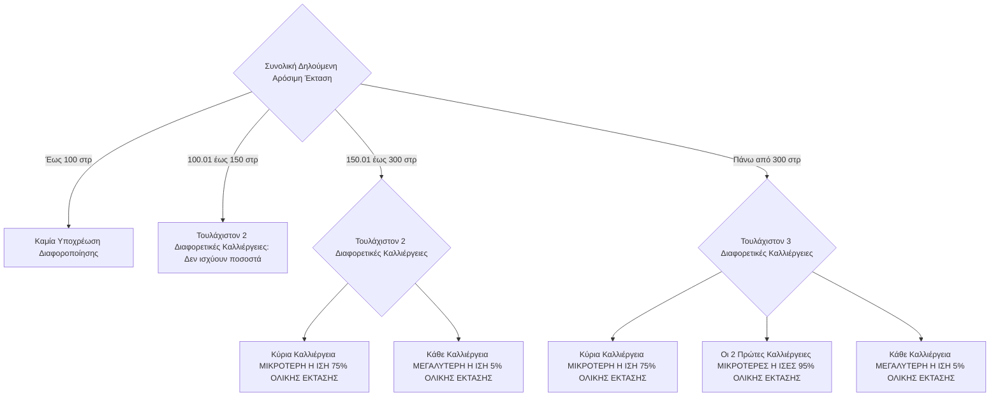

# Κανόνες Διαφοροποίησης Καλλιεργειών και Όρια Στρεμμάτων

Η τήρηση κανόνων διαφοροποίησης των καλλιεργειών είναι υποχρεωτική για τους παραγωγούς, ανάλογα με τη συνολική αρόσιμη έκταση που δηλώνουν, προκειμένου να λάβουν τη [[02.9 - Καρτέλα 11 - Δικαιώματα Βασικής Ενίσχυσης|βασική ενίσχυση]]. Οι κανόνες αυτοί έχουν αντικαταστήσει παλαιότερες απαιτήσεις, όπως η υποχρεωτική αμειψισπορά.

## Αγρανάπαυση
Στο τρέχον καθεστώς:
*   Η αγρανάπαυση (η μη καλλιέργεια ενός αγροτεμαχίου) **δεν είναι υποχρεωτική** ως συγκεκριμένη καλλιέργεια για την κάλυψη των ορίων διαφοροποίησης.
*   Ωστόσο, **μπορεί να χρησιμοποιηθεί** και να προσμετρηθεί ως μία από τις απαιτούμενες διαφορετικές καλλιέργειες.

## Όρια Στρεμμάτων και Υποχρεώσεις Διαφοροποίησης

Οι υποχρεώσεις διαφοροποίησης κλιμακώνονται ανάλογα με τη συνολική δηλούμενη αρόσιμη έκταση του παραγωγού.

*   **Έως 100 στρέμματα (≤ 100,00 στρ.):**
    *   **Καμία υποχρέωση** διαφοροποίησης. Ο παραγωγός μπορεί να καλλιεργεί μία μόνο καλλιέργεια.

*   **Από 100,01 έως 150 στρέμματα (>100,00 έως ≤150,00 στρ.):**
    *   Απαιτούνται **τουλάχιστον δύο (≥2) διαφορετικές καλλιέργειες**.
    *   **Δεν υπάρχει** υποχρέωση για τήρηση συγκεκριμένων ποσοστών έκτασης ανά καλλιέργεια (δηλαδή δεν ισχύουν οι κανόνες 75%-95% που αναλύονται παρακάτω).

*   **Από 150,01 έως 300 στρέμματα (>150,00 έως ≤300,00 στρ.):**
    *   Απαιτούνται **τουλάχιστον δύο (≥2) διαφορετικές καλλιέργειες**.
    *   Η κύρια (πρώτη σε έκταση) καλλιέργεια **δεν πρέπει να υπερβαίνει το 75%** της συνολικής δηλούμενης αρόσιμης έκτασης.
    *   Κάθε μία από τις (τουλάχιστον δύο) καλλιέργειες πρέπει να καταλαμβάνει **τουλάχιστον το 5%** της συνολικής δηλούμενης αρόσιμης έκτασης.

*   **Πάνω από 300 στρέμματα (>300,00 στρ.):**
    *   Απαιτούνται **τουλάχιστον τρεις (≥3) διαφορετικές καλλιέργειες**.
    *   **Κανόνας 75%:** Η κύρια (πρώτη σε έκταση) καλλιέργεια **δεν πρέπει να υπερβαίνει το 75%** της συνολικής δηλούμενης αρόσιμης έκτασης.
        *   *Παράδειγμα:* Παραγωγός με 320 στρέμματα. Υπολογισμός: 320 στρ. * 0,75 = 240 στρ. Η πρώτη καλλιέργεια (π.χ. βαμβάκι) δεν πρέπει να ξεπερνά τα 240 στρέμματα. (Για ασφάλεια, κατά την ενημέρωση του παραγωγού, μπορεί να αναφέρεται ένα ελαφρώς μικρότερο νούμερο, π.χ. 235 στρέμματα, για να υπάρχει περιθώριο).
    *   **Κανόνας 95%:** Οι δύο πρώτες (κύριες σε έκταση) καλλιέργειες μαζί **δεν πρέπει να υπερβαίνουν το 95%** της συνολικής δηλούμενης αρόσιμης έκτασης.
        *   *Παράδειγμα (συνέχεια):* Ο παραγωγός έχει 230 στρ. βαμβάκι. Μένουν 320 - 230 = 90 στρ. Αν η δεύτερη καλλιέργειά του (π.χ. ηλιόσπορος) είναι 60 στρ. Τότε, οι δύο πρώτες μαζί είναι: 230 (βαμβάκι) + 60 (ηλιόσπορος) = 290 στρ.
        *   Έλεγχος 95%: 320 στρ. * 0,95 = 304 στρ.
        *   Δεδομένου ότι 290 στρ. < 304 στρ., ο παραγωγός είναι καλυμμένος.
    *   **Κανόνας 5%:** Κάθε μία από τις (τουλάχιστον τρεις) καλλιέργειες που δηλώνονται **δεν μπορεί να είναι κάτω από το 5%** της συνολικής δηλούμενης αρόσιμης έκτασης (δηλαδή, κάθε καλλιέργεια πρέπει να είναι ≥5% της συνολικής έκτασης).
        *   *Παράδειγμα (συνέχεια):* Απομένουν 320 - 290 = 30 στρέμματα για την τρίτη (ή και περισσότερες) καλλιέργεια. Το όριο του 5% υπολογίζεται επί της συνολικής έκτασης: 320 στρ. * 0,05 = 16 στρέμματα.
        *   Άρα, τα 30 στρέμματα που απομένουν είναι υπεραρκετά για να δηλωθεί μία τρίτη καλλιέργεια (π.χ. σιτάρι 30 στρ.) και να καλύπτεται το όριο του 5% (καθώς 30 στρ. > 16 στρ.). Κάθε επιπλέον καλλιέργεια πρέπει επίσης να καλύπτει το 5%.

## Διάγραμμα Αποφάσεων για Διαφοροποίηση Καλλιεργειών

**Σημείωση:** Οι παραπάνω κανόνες αναφέρονται στις απαιτήσεις για την "Πολλαπλή Συμμόρφωση" παλαιότερα, ενώ τώρα εντάσσονται στο πλαίσιο της "Αιρεσιμότητας" και συγκεκριμένα στα πρότυπα ΚΓΠΚ (Καλή Γεωργική και Περιβαλλοντική Κατάσταση), όπως η ΚΓΠΚ 7 "Αμειψισπορά σε αρόσιμη γη εκτός από καλλιέργειες που καλλιεργούνται κάτω από το νερό". Είναι σημαντικό να γίνεται αναφορά στις τρέχουσες εγκυκλίους του ΟΠΕΚΕΠΕ για τις ακριβείς λεπτομέρειες και τυχόν εξαιρέσεις.