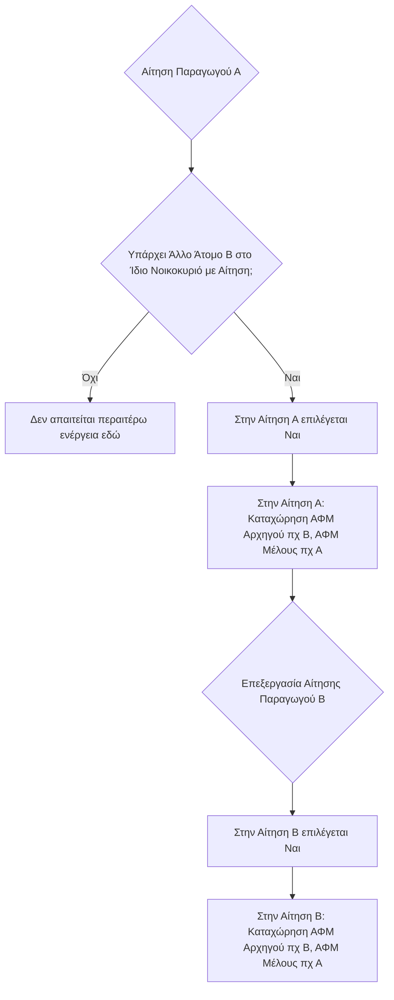

# Υπο-καρτέλα: Στοιχεία Νοικοκυριού (Αναλυτικά Στοιχεία)

Σε αυτή την υπο-καρτέλα, που βρίσκεται στην ενότητα "Αναλυτικά Στοιχεία", δηλώνεται αν ο παραγωγός (αιτών) μοιράζεται το ίδιο νοικοκυριό με κάποιο άλλο άτομο το οποίο επίσης υποβάλλει αίτηση ενιαίας ενίσχυσης.

## Σκοπός
*   Ως "ίδιο νοικοκυριό" νοούνται τα άτομα που υποβάλλουν **κοινή φορολογική δήλωση**.
*   Στην πράξη, αυτό αφορά κυρίως συζύγους όπου και οι δύο είναι κάτοχοι γεωργικής εκμετάλλευσης και υποβάλλουν ξεχωριστές αιτήσεις ενιαίας ενίσχυσης.
*   Η ορθή δήλωση είναι σημαντική για την αποφυγή διπλών δηλώσεων εκτάσεων ή άλλων ασυμβατοτήτων και σχετίζεται με την [[01.1 - Check List Αίτησης|ομαδοποίηση αιτήσεων]] που μπορεί να έχει σημειωθεί στο check list.

## Ενέργειες που Απαιτούνται

1.  **Ερώτηση:** "Υποβάλλει αίτηση ενίσχυσης και άλλο άτομο του ίδιου νοικοκυριού;"
    *   Αν ισχύει η παραπάνω συνθήκη (δηλαδή, άλλο μέλος του ίδιου νοικοκυριού υποβάλλει επίσης αίτηση ενίσχυσης), επιλέγουμε **"Ναι"**.
    *   Αν δεν ισχύει, επιλέγουμε "Όχι".

2.  **Σε περίπτωση επιλογής "Ναι":**
    *   Εμφανίζεται ένας πίνακας όπου πρέπει να καταχωρηθούν τα ΑΦΜ των εμπλεκόμενων ατόμων:
        *   **"ΑΦΜ Αρχηγού Νοικοκυριού":** Καταχωρείται το ΑΦΜ του ατόμου που θεωρείται ο "αρχηγός" του νοικοκυριού όσον αφορά τη γεωργική εκμετάλλευση.
            *   Συνήθως, αυτό είναι το άτομο με τη μεγαλύτερη έκταση καλλιεργειών ή τα περισσότερα [[02.9 - Καρτέλα 11 - Δικαιώματα Βασικής Ενίσχυσης|δικαιώματα ενίσχυσης]].
            *   **Στην περίπτωση συζύγων:**
                *   Στην αίτηση της συζύγου, ως "ΑΦΜ Αρχηγού" καταχωρείται το ΑΦΜ του συζύγου.
                *   Στην αίτηση του συζύγου, ως "ΑΦΜ Αρχηγού" καταχωρείται το δικό του ΑΦΜ.
        *   **"ΑΦΜ Μέλους":** Καταχωρείται το ΑΦΜ του άλλου ατόμου του νοικοκυριού που επίσης υποβάλλει αίτηση.

3.  **Σημαντική Διευκρίνιση:**
    *   Η διαδικασία καταχώρησης των ΑΦΜ (αρχηγού και μέλους) πρέπει να γίνει **και στις δύο αιτήσεις** (δηλαδή, τόσο στην αίτηση του ατόμου που θεωρείται "αρχηγός" όσο και στην αίτηση του άλλου "μέλους"), δηλώνοντας το άλλο άτομο αντίστοιχα.

## Διάγραμμα Ροής Καταχώρησης Στοιχείων Νοικοκυριού

*Σημείωση: Η παραπάνω λογική για το "ΑΦΜ Αρχηγού" και "ΑΦΜ Μέλους" μπορεί να διαφέρει ελαφρώς ανάλογα με την ακριβή υλοποίηση του συστήματος. Στην πράξη, συχνά στην αίτηση του ενός συζύγου δηλώνεται ο άλλος ως μέλος, και αντίστροφα, με το ΑΦΜ αρχηγού να είναι αυτό του κύριου κατόχου της εκμετάλλευσης ή του συζύγου που αναφέρεται ως "κεφαλή" στη φορολογική δήλωση.*