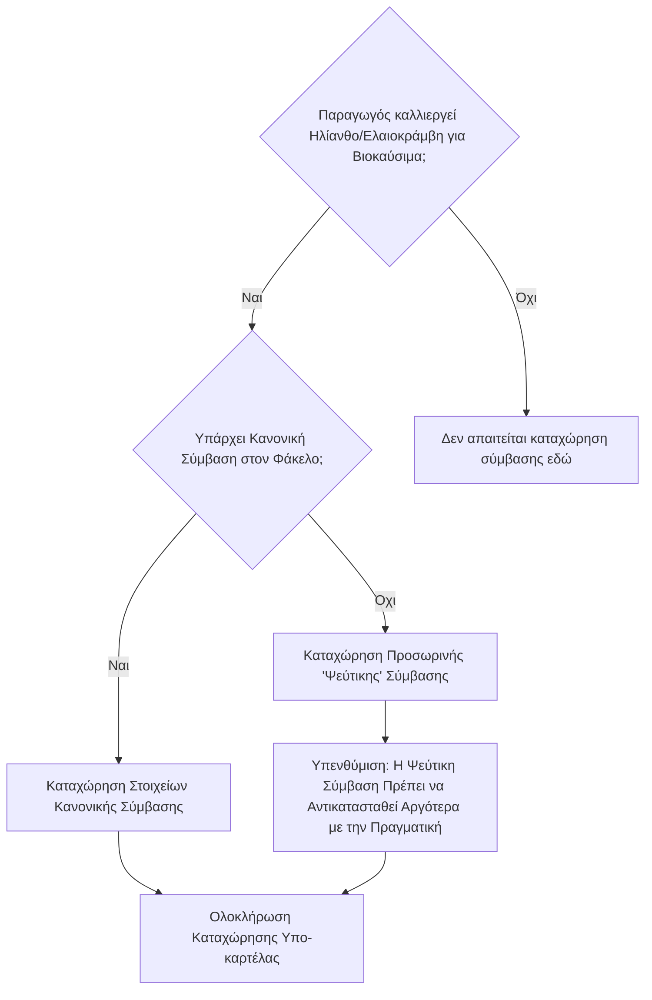

# Υπο-καρτέλα: Επιχειρήσεις Παραγωγής Βιοκαυσίμων (Αναλυτικά Στοιχεία)

Η συμπλήρωση αυτής της υπο-καρτέλας, που βρίσκεται στην ενότητα "Αναλυτικά Στοιχεία", είναι **πολύ σημαντική** και πρέπει να γίνεται **πριν από την έναρξη της καταχώρησης των στοιχείων των [[04 - Αγροτεμάχια/04.0 - Αγροτεμάχια - Εισαγωγή και Πλοήγηση|αγροτεμαχίων]]**, ιδίως αν ο παραγωγός καλλιεργεί ηλίανθο (ή ελαιοκράμβη) τον οποίο προτίθεται να παραδώσει σε επιχείρηση παραγωγής βιοκαυσίμων.

## Σκοπός
Εδώ καταχωρούνται οι συμβάσεις που έχει συνάψει ο παραγωγός με μεταποιητικές εταιρείες για την παράδοση της παραγωγής του ηλίανθου (ή ελαιοκράμβης) με σκοπό την παραγωγή βιοκαυσίμων. Η ύπαρξη έγκυρης σύμβασης είναι απαραίτητη προϋπόθεση για:
*   Την παράδοση του προϊόντος για αυτόν τον σκοπό.
*   Τη λήψη των σχετικών [[02.7 - Καρτέλα 9 - Αιτήματα Άμεσων Ενισχύσεων|συνδεδεμένων ενισχύσεων]] (αν προβλέπονται για τη συγκεκριμένη καλλιέργεια και σύμβαση).

## Πώς Γνωρίζουμε αν Πρέπει να Καταχωρηθεί Σύμβαση
Η ανάγκη για καταχώρηση σύμβασης εντοπίζεται ελέγχοντας:
1.  Την έντυπη δήλωση καλλιέργειας του προηγούμενου έτους (π.χ., του 2024 για την αίτηση του 2025).
2.  Κυρίως, τις χειρόγραφες σημειώσεις πάνω σε αυτήν την έντυπη δήλωση, οι οποίες υποδεικνύουν τις καλλιέργειες για το τρέχον έτος.
3.  Το [[01 - Εισαγωγή και Βασικά Εργαλεία/01.1 - Check List Αίτησης|check list]], όπου μπορεί να αναφέρεται η καλλιέργεια ηλίανθου για βιοκαύσιμα.

Αν από αυτές τις πηγές προκύπτει ότι ο παραγωγός θα καλλιεργήσει Ηλίανθο (ή Ηλιόσπορο, ή "Φεγγάρι" – τοπική ονομασία για τον ηλίανθο) για τον σκοπό αυτό, προχωρούμε στην καταχώρηση της σύμβασης.

## Διαδικασία Καταχώρησης Σύμβασης

*   **Περίπτωση 1: Η κανονική σύμβαση υπάρχει ήδη στον φάκελο του παραγωγού.**
    1.  Επιλέγουμε "Νέα Εγγραφή".
    2.  **Κωδικός Επιχείρησης:** Από τον αναδυόμενο φακό, επιλέγουμε την επωνυμία της μεταποιητικής εταιρείας (π.χ., "ΠΑΥΛΟΣ Ν. ΠΕΤΤΑΣ ΑΕΒΕ").
    3.  **Κωδικός Ποικιλίας/Καλλιέργειας:** Επιλέγουμε τον κωδικό "16" που αντιστοιχεί στον Ηλίανθο (ή τον αντίστοιχο για την ελαιοκράμβη).
    4.  **Αριθμός Σύμβασης:** Καταχωρούμε τον μοναδικό αριθμό της σύμβασης.
    5.  **Ημερομηνία Σύμβασης:** Καταχωρούμε την ημερομηνία υπογραφής/έναρξης ισχύος.
    6.  **Έκταση (σε εκτάρια):** Καταχωρούμε τη συνολική έκταση που καλύπτει η σύμβαση, σε εκτάρια (π.χ., 44 στρέμματα = 4,4 εκτάρια).

*   **Περίπτωση 2: Η κανονική σύμβαση ΔΕΝ υπάρχει ακόμα στον φάκελο (αλλά γνωρίζουμε ότι θα υπάρξει).**
    *   Για να μην εμποδίζεται η διαδικασία, καταχωρούμε προσωρινά μια **"ψεύτικη" σύμβαση**. Αυτή θα διορθωθεί αργότερα με τα στοιχεία της πραγματικής σύμβασης.
    *   **Στοιχεία "Ψεύτικης" Σύμβασης (Μόνο για Ηλίανθο/Ελαιοκράμβη):**
        *   **Κωδικός Επιχείρησης:** Επιλέγουμε πάντα την ίδια προκαθορισμένη επιχείρηση (π.χ., "ΠΑΥΛΟΣ Ν. ΠΕΤΤΑΣ ΑΕΒΕ" - συνήθως κωδικός "1").
        *   **Κωδικός Ποικιλίας/Καλλιέργειας:** "16" (για Ηλίανθο) ή ο αντίστοιχος για ελαιοκράμβη.
        *   **Αριθμός Σύμβασης:** "1".
        *   **Ημερομηνία Σύμβασης:** "01/01/τρέχοντος_έτους_αίτησης" (π.χ., "01/01/2025").
        *   **Έκταση (σε εκτάρια):** "1" (αντιστοιχεί σε 10 στρέμματα, τυπική τιμή).
    *   Η "ψεύτικη" σύμβαση καταχωρείται **αποκλειστικά για Ηλίανθο/Ελαιοκράμβη** και μόνο αν η πραγματική δεν είναι άμεσα διαθέσιμη.

*   **Περίπτωση Πολλαπλών Συμβάσεων:**
    *   Αν ο παραγωγός έχει πολλαπλές συμβάσεις (με την ίδια ή διαφορετικές εταιρείες), **κάθε σύμβαση καταχωρείται ξεχωριστά** ως νέα εγγραφή.

## Διάγραμμα Διαδικασίας Καταχώρησης Σύμβασης Ηλίανθου

