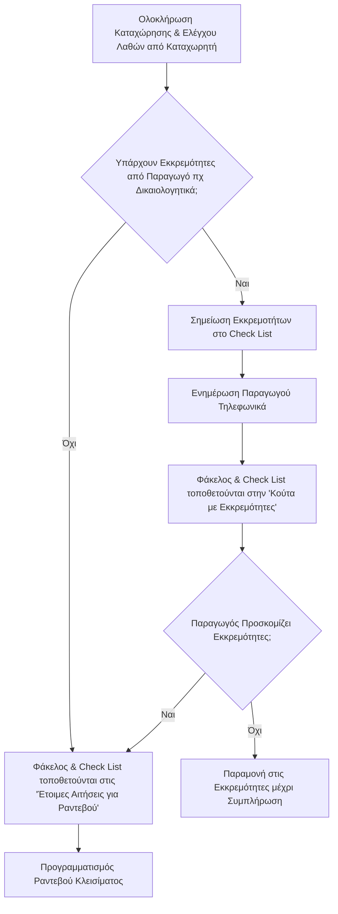

# Προετοιμασία Φακέλου για Ραντεβού Κλεισίματος

Αφού η αίτηση είναι πλήρως ελεγμένη και διορθωμένη από τον καταχωρητή (δηλαδή, δεν υπάρχουν άλλα κρίσιμα σφάλματα που μπορεί να διορθώσει και όλα τα απαραίτητα στοιχεία έχουν καταχωρηθεί μετά τον [[06.1 - Ολοκλήρωση Καταχώρησης και Έλεγχος Λαθών|Έλεγχο Λαθών]]), ακολουθεί η προετοιμασία του φυσικού φακέλου για το ραντεβού κλεισίματος με τον παραγωγό.

## Διαδικασία Προετοιμασίας

1.  **Περίπτωση 1: Δεν υπάρχουν εκκρεμότητες από την πλευρά του παραγωγού.**
    *   Αυτό σημαίνει ότι ο παραγωγός έχει προσκομίσει όλα τα απαραίτητα [[03.5 - Δικαιολογητικά (Αναλυτικά)|δικαιολογητικά]], όπως:
        *   Τιμολόγια αγοράς σπόρων, λιπασμάτων κ.λπ.
        *   Καρτελάκια πιστοποιημένου σπόρου.
        *   Έγκυρα ενοικιαστήρια.
        *   Υπογεγραμμένη και θεωρημένη [[02.4 - Τρόπος Προκαταβολής Ασφαλιστικής Εισφοράς ΕΛΓΑ|εξουσιοδότηση ΕΛΓΑ]].
        *   Οποιοδήποτε άλλο απαιτούμενο έγγραφο.
    *   **Ενέργεια:** Ο φυσικός φάκελος της αίτησης (μαζί με το συμπληρωμένο [[01 - Εισαγωγή και Βασικά Εργαλεία/01.1 - Check List Αίτησης|check list]]) παραδίδεται στο ειδικό σημείο συλλογής των **"Έτοιμων Αιτήσεων για Ραντεβού"**.
    *   Από εκεί, οι υπεύθυνοι θα προγραμματίσουν το ραντεβού με τον παραγωγό για την τελική επισκόπηση, υπογραφή και οριστικοποίηση της αίτησης.

2.  **Περίπτωση 2: Εξακολουθούν να υπάρχουν εκκρεμότητες από την πλευρά του παραγωγού.**
    *   Αυτό συμβαίνει όταν ο καταχωρητής έχει ολοκληρώσει την εργασία του, αλλά λείπουν ακόμα δικαιολογητικά από τον παραγωγό (π.χ., δεν έφερε ένα τιμολόγιο, λείπει ενοικιαστήριο, δεν επέστρεψε την θεωρημένη εξουσιοδότηση ΕΛΓΑ).
    *   **Ενέργειες:**
        1.  Στο [[01 - Εισαγωγή και Βασικά Εργαλεία/01.1 - Check List Αίτησης|check list]] σημειώνονται με σαφήνεια οι εκκρεμότητες αυτές.
        2.  Ο παραγωγός πρέπει να ενημερωθεί τηλεφωνικά για τις εκκρεμότητες και να του ζητηθεί να τις προσκομίσει το συντομότερο δυνατό.
        3.  Ο φυσικός φάκελος της αίτησης, σε αυτή την περίπτωση, τοποθετείται σε ένα διαφορετικό, ειδικό σημείο συλλογής (π.χ., μια **"Κούτα με Εκκρεμότητες"**).
        *   Οι αιτήσεις που βρίσκονται εκεί είναι μεν δουλεμένες ως προς την καταχώρηση, αλλά δεν μπορούν να προχωρήσουν για ραντεβού κλεισίματος μέχρι να τακτοποιηθούν οι εκκρεμότητες.

## Διάγραμμα Ροής Προετοιμασίας Φακέλου για Κλείσιμο

**Υπενθύμιση:** Η οριστικοποίηση της αίτησης γίνεται από τις υπαλλήλους που έχουν την άμεση επαφή *με* τον παραγωγό κατά το ραντεβού, και όχι από τον καταχωρητή.