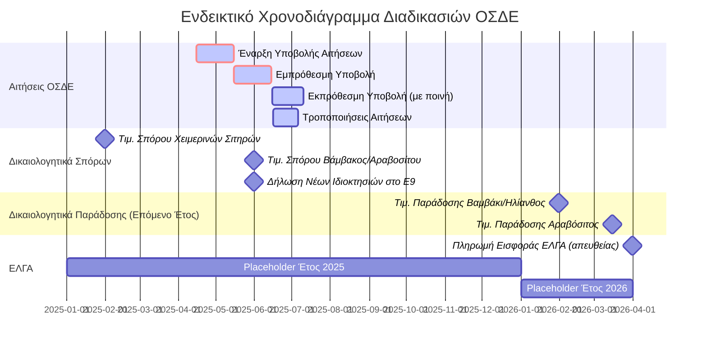

# Κρίσιμες Ημερομηνίες και Προθεσμίες

Η τήρηση των προθεσμιών είναι εξαιρετικά σημαντική στη διαδικασία υποβολής αιτήσεων ΟΣΔΕ και για τη λήψη των ενισχύσεων. Οι παρακάτω ημερομηνίες είναι ενδεικτικές και **πρέπει πάντα να επιβεβαιώνονται από τις τρέχουσες εγκυκλίους του ΟΠΕΚΕΠΕ** για το συγκεκριμένο έτος ενίσχυσης.

## Γενικές Προθεσμίες Αίτησης
*   **Έναρξη Υποβολής Αιτήσεων ΟΣΔΕ:** Συνήθως την άνοιξη κάθε έτους (π.χ. Απρίλιος/Μάιος).
*   **Καταληκτική Ημερομηνία Εμπρόθεσμης Υποβολής Αιτήσεων ΟΣΔΕ:** Ορίζεται από τον ΟΠΕΚΕΠΕ (π.χ. μέσα Ιουνίου). Η υποβολή μετά από αυτή την ημερομηνία συνήθως επιφέρει ποινές μείωσης των ενισχύσεων.
*   **Καταληκτική Ημερομηνία Εκπρόθεσμης Υποβολής Αιτήσεων ΟΣΔΕ (με ποινή):** Συνήθως περίπου 25 ημέρες μετά την εμπρόθεσμη καταληκτική ημερομηνία (π.χ. αρχές Ιουλίου).
*   **Καταληκτική Ημερομηνία για Τροποποιήσεις Αιτήσεων:** Ορίζεται από τον ΟΠΕΚΕΠΕ, συνήθως μετά την εμπρόθεσμη υποβολή.

## Προθεσμίες για Δικαιολογητικά Συνδεδεμένων Ενισχύσεων

### Τιμολόγια Αγοράς Πιστοποιημένου Σπόρου
*   **Χειμερινά Σιτηρά (π.χ. [[04.5 - Υποκαρτέλα Φυτικό Κεφάλαιο Αγροτεμαχίου|σκληρό σιτάρι]], μαλακό σιτάρι, κριθάρι):**
    *   Το τιμολόγιο αγοράς του σπόρου πρέπει να έχει ημερομηνία έκδοσης **έως τις 31 Ιανουαρίου** του έτους υποβολής της αίτησης (π.χ. για αίτηση ΟΣΔΕ 2025, τιμολόγιο έως 31/01/2025).
*   **Βαμβάκι:**
    *   Το τιμολόγιο αγοράς του σπόρου πρέπει να έχει ημερομηνία έκδοσης **έως τις 31 Μαΐου** του έτους υποβολής της αίτησης (π.χ. για αίτηση 2025, τιμολόγιο έως 31/05/2025).
    *   *Εξαίρεση:* Αν υπάρχει δελτίο αποστολής για τον σπόρο με ημερομηνία έκδοσης έως 31/05, και το τελικό τιμολόγιο εκδοθεί τον Ιούνιο, το δικαιολογητικό γίνεται δεκτό.
*   **Αραβόσιτος:**
    *   Το τιμολόγιο αγοράς του σπόρου πρέπει να έχει ημερομηνία έκδοσης **έως τις 31 Μαΐου** του έτους υποβολής της αίτησης.

*Σημείωση:* Τιμολόγια με μεταγενέστερες ημερομηνίες (εκτός της εξαίρεσης βαμβακιού) δεν καλύπτουν την τρέχουσα χρονιά, αλλά μπορεί να χρησιμοποιηθούν για την επόμενη. Το σύστημα συνήθως εμφανίζει προειδοποιήσεις.

### Τιμολόγια Παράδοσης/Πώλησης Προϊόντος (όπου απαιτούνται)
*   **Βαμβάκι και Ηλίανθος (για [[03.4 - Επιχειρήσεις Παραγωγής Βιοκαυσίμων (Αναλυτικά)|βιοκαύσιμα]] ή μεταποίηση):**
    *   Η ημερομηνία του τιμολογίου παράδοσης/πώλησης μπορεί να είναι **έως τις 31 Ιανουαρίου του επόμενου έτους** από το έτος καλλιέργειας (π.χ. για καλλιέργεια 2025, τιμολόγιο έως 31/01/2026).
    *   *Για το Βαμβάκι:* Δεν απαιτείται προσκόμιση του τιμολογίου παράδοσης από τον παραγωγό, τα στοιχεία αντλούνται ηλεκτρονικά από τα εκκοκκιστήρια.
*   **Αραβόσιτος (για [[02.7 - Καρτέλα 9 - Αιτήματα Άμεσων Ενισχύσεων|συνδεδεμένη ενίσχυση]]):**
    *   Η ημερομηνία του τιμολογίου παράδοσης/πώλησης μπορεί να είναι **έως τις 15 Μαρτίου του επόμενου έτους** από το έτος καλλιέργειας (π.χ. για καλλιέργεια 2025, τιμολόγιο έως 15/03/2026). Απαιτείται προσκόμιση του τιμολογίου.
*   **Χειμερινά Σιτηρά:** Δεν ορίζεται συγκεκριμένη καταληκτική ημερομηνία για το τιμολόγιο πώλησης, καθώς η συγκομιδή και πιθανή πώληση γίνονται εντός του ίδιου καλλιεργητικού έτους.

## Άλλες Σημαντικές Προθεσμίες
*   **Πληρωμή Ασφαλιστικής Εισφοράς [[02.4 - Τρόπος Προκαταβολής Ασφαλιστικής Εισφοράς ΕΛΓΑ|ΕΛΓΑ]] (σε περίπτωση απευθείας πληρωμής):** Συνήθως έως **31 Μαρτίου** του έτους που έπεται του έτους υποβολής της αίτησης.
*   **Δήλωση Νέων Ιδιόκτητων Αγροτεμαχίων στο Ε9:** Για να μπορεί ένα πρόσφατα αποκτηθέν ιδιόκτητο αγροτεμάχιο να δηλωθεί ως ιδιόκτητο στην αίτηση ΟΣΔΕ και να αντληθεί ο [[04.2 - Υποκαρτέλα Ιδιοκτησία Αγροτεμαχίου|ΑΤΑΚ]] του, πρέπει ο παραγωγός να το έχει δηλώσει στο Ε9 του **έως τις 31 Μαΐου** του έτους υποβολής της αίτησης ΟΣΔΕ.

## Χρονοδιάγραμμα (Ενδεικτικό)

**ΠΡΟΣΟΧΗ:** Το παραπάνω χρονοδιάγραμμα είναι ενδεικτικό. Πάντα να συμβουλεύεστε τις επίσημες ανακοινώσεις του ΟΠΕΚΕΠΕ.