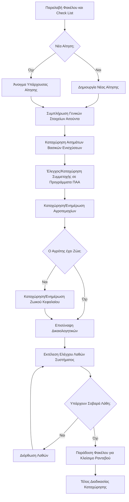

# Καλώς ήρθατε στον Οδηγό Υποβολής Αιτήσεων ΟΣΔΕ

Αυτός ο οδηγός έχει σχεδιαστεί για να σας βοηθήσει να κατανοήσετε και να διαχειριστείτε τη διαδικασία υποβολής αιτήσεων ενιαίας ενίσχυσης. Στόχος είναι η απλοποίηση πολύπλοκων διαδικασιών, ειδικά για νέους χρήστες.

## Βασικές Ενότητες Οδηγού

*   **[[01 - Εισαγωγή και Βασικά Εργαλεία/01.1 - Check List Αίτησης|1. Εισαγωγή και Βασικά Εργαλεία]]**: Ξεκινήστε από εδώ για να μάθετε για τα θεμελιώδη εργαλεία και τις αρχικές διαδικασίες.
    *   [[01 - Εισαγωγή και Βασικά Εργαλεία/01.1 - Check List Αίτησης|Check List Αίτησης]]
    *   [[01 - Εισαγωγή και Βασικά Εργαλεία/01.2 - Διαχείριση Φακέλων και Ροή Εργασίας|Διαχείριση Φακέλων και Ροή Εργασίας]]
*   **[[02 - Βασικοί Κανόνες και Οριζόντιες Καρτέλες Αίτησης/02.1 - Κανόνες Διαφοροποίησης Καλλιεργειών και Όρια Στρεμμάτων|2. Βασικοί Κανόνες και Οριζόντιες Καρτέλες Αίτησης]]**: Κατανόηση των βασικών κανόνων συμμόρφωσης και πλοήγηση στις κύριες καρτέλες της αίτησης.
    *   [[02 - Βασικοί Κανόνες και Οριζόντιες Καρτέλες Αίτησης/02.1 - Κανόνες Διαφοροποίησης Καλλιεργειών και Όρια Στρεμμάτων|Κανόνες Διαφοροποίησης Καλλιεργειών]]
    *   [[02 - Βασικοί Κανόνες και Οριζόντιες Καρτέλες Αίτησης/02.2 - Καρτέλα 1 - Γενικά Στοιχεία Αίτησης|Καρτέλα 1: Γενικά Στοιχεία Αίτησης]]
    *   [[02 - Βασικοί Κανόνες και Οριζόντιες Καρτέλες Αίτησης/02.3 - Καρτέλα 2 - Γενικά Στοιχεία Αιτούντα|Καρτέλα 2: Γενικά Στοιχεία Αιτούντα]]
    *   [[02 - Βασικοί Κανόνες και Οριζόντιες Καρτέλες Αίτησης/02.4 - Τρόπος Προκαταβολής Ασφαλιστικής Εισφοράς ΕΛΓΑ|Ασφαλιστική Εισφορά ΕΛΓΑ]]
    *   [[02 - Βασικοί Κανόνες και Οριζόντιες Καρτέλες Αίτησης/02.5 - Καρτέλα 7 - Αναδιανεμητική Ενίσχυση|Καρτέλα 7: Αναδιανεμητική Ενίσχυση]]
    *   [[02 - Βασικοί Κανόνες και Οριζόντιες Καρτέλες Αίτησης/02.6 - Καρτέλα 8 - Τομεακές Παρεμβάσεις ΠΑΑ|Καρτέλα 8: Τομεακές Παρεμβάσεις ΠΑΑ]]
    *   [[02 - Βασικοί Κανόνες και Οριζόντιες Καρτέλες Αίτησης/02.7 - Καρτέλα 9 - Αιτήματα Άμεσων Ενισχύσεων|Καρτέλα 9: Αιτήματα Άμεσων Ενισχύσεων]]
    *   [[02 - Βασικοί Κανόνες και Οριζόντιες Καρτέλες Αίτησης/02.8 - Καρτέλα 10 - Οικολογικά Σχήματα|Καρτέλα 10: Οικολογικά Σχήματα]]
    *   [[02 - Βασικοί Κανόνες και Οριζόντιες Καρτέλες Αίτησης/02.9 - Καρτέλα 11 - Δικαιώματα Βασικής Ενίσχυσης|Καρτέλα 11: Δικαιώματα Βασικής Ενίσχυσης]]
    *   [[02 - Βασικοί Κανόνες και Οριζόντιες Καρτέλες Αίτησης/02.10 - Καρτέλα 12 - Συγκατάθεση GDPR|Καρτέλα 12: Συγκατάθεση GDPR]]
*   **[[03 - Αναλυτικά Στοιχεία Αίτησης (Κάθετη Στήλη)/03.1 - Πλοήγηση στα Αναλυτικά Στοιχεία|3. Αναλυτικά Στοιχεία Αίτησης]]**: Πλοήγηση και συμπλήρωση των υπο-καρτελών στην κάθετη στήλη.
*   **[[04 - Αγροτεμάχια/04.0 - Αγροτεμάχια - Εισαγωγή και Πλοήγηση|4. Αγροτεμάχια]]**: Η πιο σύνθετη ενότητα, που αφορά τη δήλωση των αγροτεμαχίων και των καλλιεργειών.
*   **[[05 - Ζωικές Εκμεταλλεύσεις/05.1 - Ζωικές Εκμεταλλεύσεις - Γενικά|5. Ζωικές Εκμεταλλεύσεις]]**: Διαχείριση των πληροφοριών για το ζωικό κεφάλαιο.
*   **[[06 - Ολοκλήρωση και Τελικές Διαδικασίες/06.1 - Ολοκλήρωση Καταχώρησης και Έλεγχος Λαθών|6. Ολοκλήρωση και Τελικές Διαδικασίες]]**: Έλεγχος λαθών, σκανάρισμα και προετοιμασία για το κλείσιμο της αίτησης.
*   **[[07 - Εργαλεία και Αναφορές/07.1 - Γλωσσάρι Όρων ΟΣΔΕ|7. Εργαλεία και Αναφορές]]**: Γλωσσάρι όρων και άλλες χρήσιμες πληροφορίες.

## Πλοήγηση
Χρησιμοποιήστε τους εσωτερικούς συνδέσμους (wikilinks) για να μεταβείτε εύκολα μεταξύ των σχετικών ενοτήτων. Τα backlinks θα σας βοηθήσουν να δείτε ποιες σημειώσεις αναφέρονται στην τρέχουσα.

Καλή αρχή!

## Ενδεικτικό διάγραμμα μακροσκοπικής απεικόνισης διαδικασίας καταχώρησης:
