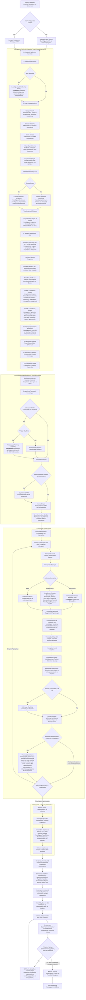

```mermaid
graph TD
    A[Έναρξη Παραλαβή Φακέλου Παραγωγού και Check List] --> B{Αίτηση Υπάρχει στο Σύστημα}
    B -- Όχι --> BA[Δημιουργία Νέας Αίτησης Συμπλήρωση ΑΦΜ και Βασικών Στοιχείων]
    BA --> C[Επεξεργασία Οριζόντιων Καρτελών]
    B -- Ναι --> BN[Άνοιγμα Υπάρχουσας Αίτησης με ΑΦΜ]
    BN --> C

    subgraph Επεξεργασία Οριζόντιων Καρτελών Γενικά Στοιχεία έως GDPR
        C --> C1[1 Γενικά Στοιχεία Αίτησης]
        C1 --> C1a{Νέος Δικαιούχος}
        C1a -- Ναι --> C1b[Συμπλήρωση Εκπαίδευσης Ηλικίας<br><b>Υπενθύμιση</b> Αίτημα για Εθνικό Απόθεμα στις Άμεσες Ενισχύσεις ΟΠΩΣΔΗΠΟΤΕ]
        C1a -- Όχι --> C2[2 Γενικά Στοιχεία Αιτούντα]
        C1b --> C2
        C2 --> C2a[Έλεγχος Αλλαγή Ταυτότητας ΔΟΥ Στοιχείων Επικοινωνίας - Μοναδικό Κινητό Email]
        C2a --> C2b[Επιλογή Ψηφιακής Εφαρμογής αν Οικ Σχήμα Λιπασμάτων]
        C2b --> C3[3 Άλλα Στοιχεία Ασφαλιστικά ΟΓΑ ΑΜΚΑ Συνεταιρισμοί]
        C3 --> C4[4 Έδρα Εκμετάλλευσης Διεύθυνση Δασαρχείο - Πάντα Διδυμοτείχου εκτός εξαιρέσεων]
        C4 --> C5[5 Τραπεζικά Στοιχεία Έλεγχος Αλλαγή IBAN - Όνομα Δικαιούχου στο Βιβλιάριο]
        C5 --> C6[6 ΕΛΓΑ Τρόπος Πληρωμής]
        C6 --> C6a{Εξουσιοδότηση}
        C6a -- Ναι --> C6b[Επιλογή Ποσοστού Μεταβολής<br><b>Υπενθύμιση</b> Εκτύπωση εντύπου για υπογραφή θεώρηση αργότερα]
        C6a -- Όχι --> C6c[Επιλογή Ποσοστού Μεταβολής<br><b>Υπενθύμιση</b> Εκτύπωση για πληρωμή στην τράπεζα μετά την οριστικοποίηση]
        C6b --> C7[7 Αναδιανεμητική Ενίσχυση]
        C6c --> C7
        C7 --> C7a[Έλεγχος Επιλεξιμότητας 20-110 στρ<br><b>Υπενθύμιση</b> Αίτημα στις Άμεσες Ενισχύσεις ΟΠΩΣΔΗΠΟΤΕ για νέους]
        C7a --> C8[8 Τομεακές Παρεμβάσεις ΠΑΑ]
        C8 --> C8a[Προσθήκη Εξισωτικής 13.1 13.2 13.3 αν δικαιούται<br>Έλεγχος άλλων ενεργών προγραμμάτων δεν διαγράφουμε υπάρχοντα]
        C8a --> C9[9 Αιτήματα Άμεσων Ενισχύσεων]
        C9 --> C9a[Προσθήκη Βασικών ΒΙΣΣ Αναδιανεμητική Εθνικό Απόθεμα Νέων Γεωργών]
        C9a --> C9b[Προσθήκη ΟΛΩΝ των πιθανών Συνδεδεμένων Ενισχύσεων Φυτικών και Ζωικών]
        C9b --> C9c[Για κάθε Συνδεδεμένη Φυτική<br>Καταχώρηση Στοιχείων Σπόρου Ετικετών ποικιλίες κιλά αριθμός καρτελών - προσοχή σε διαφορετικές σπορομερίδες και χύμα κιλά]
        C9c --> C9d[Για κάθε Συνδεδεμένη Φυτική<br>Καταχώρηση Τιμολογίων Αγοράς Σπόρου ΑΦΜ Επων Προμηθευτή Αρ Σειρά Ημερ Τιμολογίου - έλεγχος ημερομηνιών]
        C9d --> C9e[Για Κτηνοτροφικά Όσπρια Αραβόσιτο<br><b>Υπενθύμιση</b> Θα απαιτηθεί και Τιμολόγιο Πώλησης καταχώρηση αργότερα]
        C9e --> C10[10 Οικολογικά Σχήματα Γενική Επιλογή βάσει Check List]
        C10 --> C11[11 Δικαιώματα Ενίσχυσης Ενημερωτικός Έλεγχος Αντιστοιχίας]
        C11 --> C12[12 Συγκατάθεση GDPR Επιβεβαίωση Εισαγωγή Ναι σε όλα]
    end

    C12 --> D[Επεξεργασία Κάθετων Καρτελών Αναλυτικά Στοιχεία από κάτω προς τα πάνω]
    subgraph Επεξεργασία Κάθετων Καρτελών Αναλυτικά Στοιχεία
        D --> D1[Επιχειρήσεις Παραγωγής Βιοκαυσίμων]
        D1 --> D1a{Καλλιεργεί Ηλίανθο Ελαιοκράμβη για Παράδοση}
        D1a -- Ναι --> D1b{Υπάρχει Σύμβαση}
        D1b -- Ναι --> D1c[Καταχώρηση Στοιχείων Πραγματικής Σύμβασης]
        D1b -- Όχι --> D1d[Καταχώρηση Ψεύτικης Σύμβασης<br><b>Υπενθύμιση</b> Επιχείρηση 1 Αρ Σύμβασης 1 Ημερ 01 01 ΕΤΟΥΣ Έκταση 1ha]
        D1a -- Όχι --> D2[Στοιχεία Νοικοκυριού]
        D1c --> D2
        D1d --> D2
        D2 --> D2a{Κοινή Φορολογική Δήλωση με Άλλο Αιτούντα}
        D2a -- Ναι --> D2b[Συμπλήρωση ΑΦΜ Αρχηγού Μέλους και στις δύο αιτήσεις]
        D2a -- Όχι --> D3[Ηλεκτροδότηση Αγροτεμαχίων Συνήθως δεν επεμβαίνουμε]
        D2b --> D3
        D3 --> D4[Δικαιολογητικά και Ομάδες Παραγωγών Συμπλήρωση Αργότερα μετά τα Αγροτεμάχια]
    end

    D4 --> E[Καρτέλα Αγροτεμάχια Επεξεργασία ανά Αγροτεμάχιο]
    subgraph Επεξεργασία Αγροτεμαχίων
        E --> E1[Επιλογή Αγροτεμαχίου από λίστα ή με φίλτρα ταξινόμηση]
        E1 --> E2[Υποκαρτέλα Γενικά Στοιχεία Αγροτεμαχίου Έλεγχος]
        E2 --> E3[Υποκαρτέλα Ιδιοκτησία]
        E3 --> E3a{Καθεστώς Ιδιοκτησίας}
        E3a -- Ιδιόκτητο Ε9 --> E3b[Καταχώρηση Έλεγχος ΑΤΑΚ από ΑΑΔΕ<br><b>Υπενθύμιση</b> Δήλωση στο Ε9 έως 31 5]
        E3a -- Ενοικιαζόμενο --> E3c[Καταχώρηση Στοιχείων Ενοικιαστηρίου<br>Ημερομηνίες Έναρξης Λήξης ΑΦΜ Επων ΑΤΑΚ Ιδιοκτήτη Έκταση Ποσοστό<br><b>Υπενθύμιση</b> Έλεγχος για ληγμένα]
        E3a -- Μικτό --> E3d[Συνδυασμός Ε9 και Ενοικιαστηρίου για τα αντίστοιχα τμήματα]
        E3b --> E4[Υποκαρτέλα Οικολογικά Σχήματα ανά Αγροτεμάχιο]
        E3c --> E4
        E3d --> E4
        E4 --> E4a[Αντιστοίχιση των Οικ Σχημάτων που επιλέχθηκαν γενικά πχ 0601 0612 0615 0616 για Λιπάσματα 09 ΧΧ για Βιολογικά]
        E4a --> E5[Υποκαρτέλα Μέτρα ΠΑΑ Έλεγχος - Εξισωτική συνήθως αυτόματα]
        E5 --> E6[Υποκαρτέλα Φυτικό Κεφάλαιο]
        E6 --> E6a[Καταχώρηση Αλλαγή Καλλιέργειας και Ποικιλίας βάσει νέας δήλωσης]
        E6a --> E6b[Κούμπωμα Συνδεδεμένης Ενίσχυσης από κάτω αν η καλλιέργεια κωδικός το επιτρέπει]
        E6b --> E6c{Ηλίανθος Ενεργειακός Κωδ 16}
        E6c -- Ναι --> E6d[Κούμπωμα Σύμβασης Βιοκαυσίμων από κάτω]
        E6c -- Όχι --> E6e[Έλεγχος Επιλογή Άρδευσης Καλλιέργειας Ποτιστικό Ξηρικό και Χρήσης Νερού]
        E6d --> E6e
        E6e --> E6f{Επάρκεια Πιστοποιημένου Σπόρου για Συνδεδεμένη}
        E6f -- Όχι --> E6g[Υπολογισμός Κάλυψης<br>Καταχώρηση μέρους ως με καρτέλα συνδεδεμένη και μέρους ως χωρίς καρτέλα χωρίς συνδεδεμένη πχ Λοιπά Σιτηρά Κωδ 2<br>Πιθανό σπάσιμο αγροτεμαχίου σε πολλαπλές εγγραφές στο Φυτικό Κεφάλαιο]
        E6f -- Ναι ή για καλλιέργειες χωρίς απαίτηση σπόρου --> E6h{Επόμενο Αγροτεμάχιο ή Ολοκλήρωση}
        E6g --> E6h
        E6h -- Επόμενο Αγροτεμάχιο --> E1
    end

    E6h -- Ολοκλήρωση Αγροτεμαχίων --> F[Καρτέλα Ζωικές Εκμεταλλεύσεις αν υπάρχουν]
    subgraph Επεξεργασία Ζωικών Εκμεταλλεύσεων
        F --> F1[Βοοειδή Συνήθως δεν επεμβαίνουμε αυτόματη ενημέρωση]
        F1 --> F2[Αιγοπρόβατα Ενημέρωση αριθμού ζώων βάσει μητρώου δήλωσης<br><b>Υπενθύμιση</b> Παραδοθείσα Ποσότητα Γάλακτος συμπληρώνεται στο κλείσιμο]
        F2 --> F3[Μελίσσια Ενημέρωση αριθμού κυψελών βάσει βιβλιαρίου]
    end

    F3 --> G[Επιστροφή στα Αναλυτικά Στοιχεία Συμπλήρωση Υποκαρτέλας Δικαιολογητικά]
    G --> G1[Επισύναψη ΟΛΩΝ των σκαναρισμένων δικαιολογητικών ΕΛΓΑ Τιμολόγια Καρτέλες Ενοικιαστήρια Μητρώα Δήλωση Βοσκής κλπ]
    G1 --> H[Επιστροφή στα Αναλυτικά Στοιχεία Συμπλήρωση Υποκαρτέλας Ομάδες Παραγωγών]
    H --> H1[Επιλογή Ομάδας για κάθε καλλιέργεια πχ Μεμονωμένος ΔΟΒ για Βαμβάκι]

    H1 --> I[Εκτέλεση Ελέγχου Λαθών από μενού Ενέργειες]
    I --> J[Επισκόπηση Συγκεντρωτικών Στοιχείων Φυτικό Κεφάλαιο Απαιτούμενες Ποσότητες Σπόρου]
    J --> K{Υπάρχουν Κρίσιμα Σφάλματα ή Εκκρεμότητες από τον Παραγωγό}
    K -- Ναι --> L[Διόρθωση Σφαλμάτων<br>Αν εκκρεμότητες παραγωγού Ενημέρωση παραγωγού και τοποθέτηση φακέλου σε Εκκρεμότητες]
    L --> I
    K -- Όχι Μόνο ενημερωτικά μηνύματα ή όλα ΟΚ --> M[Φάκελος Έτοιμος Τοποθέτηση σε Έτοιμα για Ραντεβού Κλεισίματος]
    M --> N[Τέλος Διαδικασίας Καταχώρησης από Εσάς]
```
